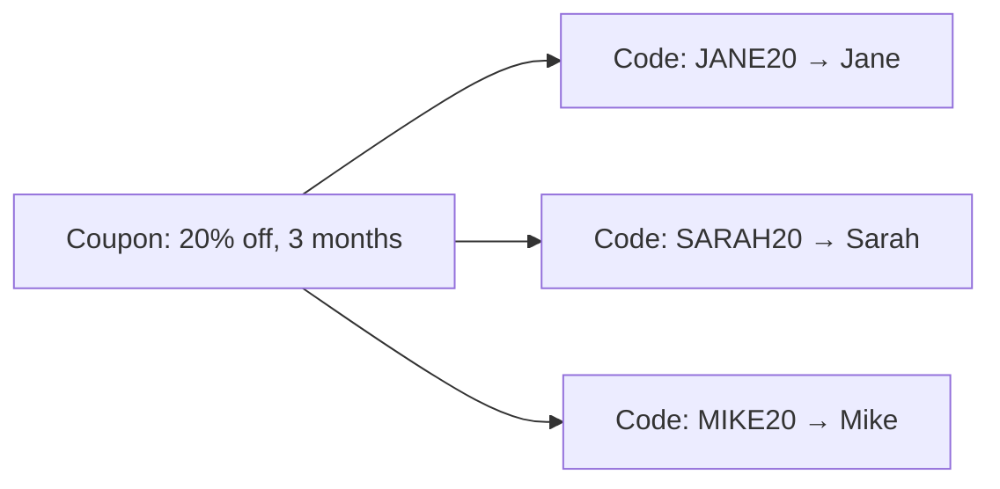

Referly splits discounts into two objects. A **coupon** defines the discount — how much comes off, how long it applies, and how often it can be used. A **promotional code** is the string a customer types at checkout, and it is what ties a redemption back to a specific affiliate.

One coupon can have many promotional codes, so a single "20% off for 3 months" definition can back a unique code for every affiliate in your program.



## Coupons

A coupon carries the discount rules. Only `name` is required — everything else falls back to a default.

<ParamField body="name" type="string" required>
  Internal name for the coupon. Also usable as a lookup key on `GET /coupons`.
</ParamField>

<ParamField body="couponType" type="string" default="PERCENTAGE">
  `PERCENTAGE` or `FLAT`. A `PERCENTAGE` coupon requires `percentOff` between 1 and 100. A `FLAT`
  coupon requires both `amountOff` and `currency`.
</ParamField>

<ParamField body="duration" type="string" default="forever">
  `once`, `forever`, or `repeating`. A `repeating` coupon requires `durationInMonths`.
</ParamField>

<ParamField body="maxRedemptions" type="integer">
  Total redemptions allowed across every promotional code attached to this coupon.
</ParamField>

<ParamField body="redeemBy" type="string">
  ISO 8601 date after which the coupon can no longer be redeemed.
</ParamField>

<ParamField body="limitToProducts" type="boolean" default="false">
  Restrict the discount to the products listed in `productIds`.
</ParamField>

<ParamField body="externalId" type="string">
  The identifier for this discount in your payment platform, such as a Stripe coupon ID. Must be
  unique in your program — reusing one returns `400`.
</ParamField>

### Create a coupon

```bash cURL
curl -X POST https://www.referly.so/api/v1/coupons \
  -H "Authorization: Bearer YOUR_API_KEY" \
  -H "Content-Type: application/json" \
  -d '{
    "name": "Launch discount",
    "couponType": "PERCENTAGE",
    "percentOff": 20,
    "duration": "repeating",
    "durationInMonths": 3,
    "maxRedemptions": 500
  }'
```

Coupon responses always include a `promotionalCodes` array, so a single `GET /coupons` call gives you the discount and every code that uses it. See [Create a Coupon](/api-reference/coupons/create) for the full field list.

<Note>
  Creating a coupon through the API records it in Referly only. It does not create the matching
  coupon in Stripe or any other payment platform — set `externalId` to point at a discount that
  already exists there.
</Note>

## Promotional codes

A promotional code always belongs to a coupon and inherits its discount. Assigning it to an affiliate is what makes it trackable.

<ParamField body="couponId" type="string" required>
  The parent coupon. Returns `404` if the coupon does not belong to your program.
</ParamField>

<ParamField body="code" type="string">
  The customer-facing string. Required unless you are auto-generating the code. Must be unique across
  your program.
</ParamField>

<ParamField body="affiliateId" type="string">
  The affiliate who gets credit for redemptions. You can pass `affiliateEmail` instead. Returns `404`
  if the affiliate is not in your program.
</ParamField>

<ParamField body="limitToAffiliate" type="boolean" default="false">
  Restrict the code so only the assigned affiliate can redeem it.
</ParamField>

<ParamField body="firstTimeOrder" type="boolean" default="false">
  Restrict the code to a customer's first order.
</ParamField>

<ParamField body="minimumAmount" type="number">
  Minimum order value required, paired with `minimumAmountCurrency`.
</ParamField>

<ParamField body="expiresAt" type="string">
  ISO 8601 date after which the code stops working, independent of the coupon's `redeemBy`.
</ParamField>

### Create a code for an affiliate

```bash cURL
curl -X POST https://www.referly.so/api/v1/promotional-codes \
  -H "Authorization: Bearer YOUR_API_KEY" \
  -H "Content-Type: application/json" \
  -d '{
    "couponId": "7b3f0e21-5c8a-4d9f-b012-3a4c5d6e7f80",
    "code": "JANE20",
    "affiliateEmail": "jane@example.com",
    "limitToAffiliate": true
  }'
```

A code without an affiliate is valid, but it cannot be used to attribute a sale — see [Attribute a sale to a code](#attribute-a-sale-to-a-code).

### Auto-generate a code

Instead of inventing a string yourself, set `isAutoGenerated` to `true` and describe the shape of the code with `codeStructure`. An affiliate is required, because the generator reads their details.

```bash cURL
curl -X POST https://www.referly.so/api/v1/promotional-codes \
  -H "Authorization: Bearer YOUR_API_KEY" \
  -H "Content-Type: application/json" \
  -d '{
    "couponId": "7b3f0e21-5c8a-4d9f-b012-3a4c5d6e7f80",
    "affiliateEmail": "jane@example.com",
    "isAutoGenerated": true,
    "prefix": "REF",
    "codeStructure": {
      "firstName": true,
      "discountAmount": true,
      "randomChars": true
    },
    "randomCharsLength": 4,
    "randomCharsCase": "uppercase"
  }'
```

The pieces are concatenated in a fixed order — prefix, first name, last name, email local part, discount value, coupon name, random characters — and every text part is uppercased. The request above produces something like `REFJANE20K7QZ`.

Generation happens once, at creation. If the resulting string is already taken, the request fails with `400` rather than retrying with a different one, so include `randomChars` when you generate codes in bulk.

## Attribute a sale to a code

When a customer checks out with a promotional code instead of clicking a referral link, pass `promoCode` to [Create a Sale](/api-reference/sales/create). Referly resolves the affiliate from the code, so you do not send `referralId` or `email`.

```bash cURL
curl -X POST https://www.referly.so/api/v1/sales \
  -H "Authorization: Bearer YOUR_API_KEY" \
  -H "Content-Type: application/json" \
  -d '{
    "promoCode": "JANE20",
    "totalEarned": 99
  }'
```

The sale is rejected with `400` when the code does not exist in your program, is not active, has expired, has no affiliate assigned, or when either the code or its parent coupon has hit its redemption limit.

On a successful sale, Referly increments `timesRedeemed` on both the promotional code and its coupon, which is what those limits are checked against.

## Look up coupons and codes

Both `GET` endpoints accept several identifiers and return either a single object or an array.

| Endpoint | Query parameters |
| --- | --- |
| `GET /coupons` | `id`, `name`, `externalId` — omit all three to list every coupon, newest first |
| `GET /promotional-codes` | `id`, `code`, `externalId`, `couponId`, `affiliateId`, `affiliateEmail` |

Use `couponId` to see every code issued from one discount, or `affiliateEmail` to see every code an affiliate holds.

```bash List one affiliate's codes
curl "https://www.referly.so/api/v1/promotional-codes?affiliateEmail=jane@example.com" \
  -H "Authorization: Bearer YOUR_API_KEY"
```

## Update and delete

Updates are identified by `couponId` or `promotionalCodeId` in the request body, not by a path parameter.

Changing a coupon changes the discount for every code attached to it — that is the main reason to use the two-tier model. Deleting a coupon cascades: its promotional codes are deleted with it. To retire a single code without deleting it, set `active` to `false` with [Update a Promotional Code](/api-reference/promotional-codes/update).

## Errors

Failures return a JSON object with an `error` message.

| Status | When it happens |
| --- | --- |
| `400` | A required field is missing, a discount value is out of range, a `repeating` coupon has no `durationInMonths`, or the code or `externalId` is already in use. |
| `401` | The `Authorization` header is missing or malformed, or the API key is not valid. |
| `403` | The program does not have API access on its current plan. |
| `404` | The coupon, promotional code, or affiliate was not found in your program. |
| `429` | You exceeded the rate limit for this endpoint. Slow down and retry. |

See [Authentication](/api-reference/authentication) for how to generate an API key.

## Related

<Columns cols={2}>
  <Card title="Coupon endpoints" icon="ticket" href="/api-reference/coupons/get">
    Create, read, update, and delete coupons.
  </Card>
  <Card title="Promotional code endpoints" icon="tag" href="/api-reference/promotional-codes/get">
    Create, read, update, and delete promotional codes.
  </Card>
  <Card title="Create a Sale" icon="cart-shopping" href="/api-reference/sales/create">
    Attribute a sale with a promo code.
  </Card>
  <Card title="Affiliates and referral links" icon="users" href="/api-reference/affiliate-links">
    Attribute sales with tracking links instead of codes.
  </Card>
</Columns>
