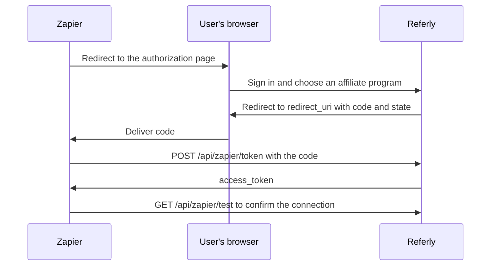

Referly's Zapier integration uses an OAuth-style authorization flow. The user picks which affiliate program to connect, and Zapier receives an access token scoped to that one program.

This page documents the flow from Zapier's side. If you are setting the integration up as a Referly customer rather than building against it, start with the [Zapier help center article](/help-center/integrations/zapier).

## How the flow works



## Send the user to the authorization page

Redirect the user's browser to:

```
https://referly.so/connect/zapier/choose-affiliate-program
```

<ParamField query="redirect_uri" type="string" required>
  Where Referly sends the user once they authorize. Referly appends the result with `?`, so this URL
  must not already contain a query string.
</ParamField>

<ParamField query="state" type="string" required>
  An opaque value that is echoed back unchanged on the redirect. Generate it per attempt and verify
  it on return to protect against CSRF.
</ParamField>

The page requires a signed-in Referly account and prompts the user to sign in first if needed. It lists every affiliate program on the account, and the user picks one and confirms.

On confirmation, Referly issues an access token for that program and redirects the browser to:

```
https://your-app.example.com/callback?code=ACCESS_TOKEN&state=YOUR_STATE
```

<Note>
  A program gets one Zapier token, created on first connection and reused afterwards. Reconnecting
  the same program returns the same token rather than issuing a new one.
</Note>

## Exchange the code for an access token

```
POST https://referly.so/api/zapier/token
```

Send the code as form data, not JSON.

<ParamField header="Content-Type" type="string" required>
  `application/x-www-form-urlencoded`
</ParamField>

<ParamField body="code" type="string" required>
  The authorization code from the redirect.
</ParamField>

```bash cURL
curl -X POST https://referly.so/api/zapier/token \
  -H "Content-Type: application/x-www-form-urlencoded" \
  -d "code=AUTHORIZATION_CODE"
```

```json 200 response
{
  "access_token": "5f2a8c31-9b04-4e6d-a7f1-c8203d5e6b90"
}
```

<ResponseField name="access_token" type="string">
  The bearer token for every subsequent request. It is scoped to the single affiliate program the
  user selected.
</ResponseField>

The endpoint does not take a `client_id`, a `client_secret`, or a `grant_type`. It validates the code and returns the token, so treat the authorization code with the same care as the token itself and exchange it server-side.

### Token lifetime

- Access tokens do not expire.
- No refresh token is issued, and there is no refresh endpoint.
- The token is not listed on the **API Keys** page in the Referly dashboard, which shows only keys created there. To end a connection, disconnect the app from the Zapier side.

## Test a connection

Zapier calls this endpoint to confirm a token still works and to label the connection.

```
GET https://referly.so/api/zapier/test
```

```bash cURL
curl https://referly.so/api/zapier/test \
  -H "Authorization: Bearer ACCESS_TOKEN"
```

```json 200 response
{
  "program_name": "Acme Partner Program"
}
```

<ResponseField name="program_name" type="string">
  The name of the connected affiliate program. On failure the response carries the auth error status
  and sets `program_name` to `Program not found`.
</ResponseField>

## Use the access token

Send the token as a bearer token on every request:

```
Authorization: Bearer ACCESS_TOKEN
```

The token unlocks a set of Zapier-specific endpoints that back the integration's triggers and actions, all scoped to the connected program:

| Path | Methods | Purpose |
| --- | --- | --- |
| `/api/zapier/affiliates` | `GET`, `POST`, `PUT`, `DELETE` | Read and manage affiliates |
| `/api/zapier/referrals` | `GET`, `POST`, `PUT`, `DELETE` | Read and manage referrals |
| `/api/zapier/sales` | `GET`, `POST`, `PUT`, `DELETE` | Read and manage sales |
| `/api/zapier/webhooks` | `POST` | Subscribe to events. Requires `url` and an `eventTypes` array |
| `/api/zapier/webhooks/{id}` | `DELETE` | Unsubscribe, using the ID returned when the subscription was created |

Triggers work by subscription: Zapier creates a webhook endpoint with the event types it cares about, then deletes it when the Zap is turned off. See [Event types](/developer-documentation/webhooks/event-types) for what you can subscribe to and [Payload structure](/developer-documentation/webhooks/payload-structure) for what Zapier receives.

The token also works against the [main API](/api-reference/introduction) at `https://www.referly.so/api/v1`, so the same connection can read affiliates, links, coupons, and sales.

## Errors

Failures return a JSON object with an `error` message.

| Status | Message | When it happens |
| --- | --- | --- |
| `400` | `Code is required` | The token request had no `code` field. |
| `400` | `Invalid code` | The code does not match a token. It was mistyped, or the connection was already removed. |
| `401` | `Unauthorized` | The `Authorization` header is missing or is not a bearer token. |
| `401` | `Invalid auth token` | The token is not recognized. |
| `403` | `User does not have API access` | The account's plan does not include API access. |
| `404` | `Affiliate program not found` | The connected program no longer exists. |
| `429` | `Too many requests. Please slow down.` | You exceeded the rate limit. Back off and retry. |

## Related

<Columns cols={2}>
  <Card title="Zapier integration guide" icon="bolt" href="/help-center/integrations/zapier">
    Set up the integration as a Referly customer.
  </Card>
  <Card title="Authentication" icon="key" href="/api-reference/authentication">
    Generate a standard API key instead of connecting through Zapier.
  </Card>
  <Card title="API introduction" icon="book" href="/api-reference/introduction">
    The endpoints your token can reach.
  </Card>
  <Card title="Affiliates and referral links" icon="users" href="/api-reference/affiliate-links">
    How affiliates and their tracking links fit together.
  </Card>
</Columns>
