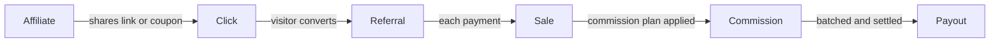

Almost everything in Referly is one chain of objects, each created by the one before it:

**a click becomes a referral, a referral produces sales, each sale produces a commission, and
commissions are settled in a payout.**

If you understand that chain and where your code plugs into it, the API and the webhooks stop
needing much explanation.

## The lifecycle



Each arrow is a moment your integration can be involved in. The first two you usually cause; the
last three Referly does for you.

## The objects

### Program

The container for everything: your affiliates, your commission plans, your tracking settings, your
coupons. Its ID is what you put in the tracking snippet as `data-program-id`, and it is safe to
expose publicly.

An API key belongs to exactly one program, which is why you never pass a program ID to the REST
API — the key already says which program you mean. If you run several brands, you run several
programs, each with its own key.

### Affiliate

A person promoting your program. Affiliates are identified by email, belong to one program, and
carry a status that controls whether they can earn:

| Status | Meaning |
| --- | --- |
| `INVITED` | Invited but has not signed up yet |
| `INACTIVE` | Signed up, waiting for your approval (shown as **Pending**) |
| `ACTIVE` | Approved and earning |
| `DECLINED` | Application rejected |
| `DEACTIVATED` | Switched off, usually temporarily |
| `BANNED` | Removed for abuse |

Each affiliate is assigned a **commission plan**, either directly or through an affiliate group.
That plan is what turns their sales into money.

### Referral link

The URL an affiliate shares. A link is a short code belonging to one affiliate, appended to your
site as a query parameter:

```
https://your-site.com/?ref=AFFILIATE_CODE
```

An affiliate can have several links — useful when they promote different landing pages or channels
and want the traffic separated in their reporting. Clicks, referrals, and sales each record which
link they came from, so the breakdown survives all the way to the commission.

<Note>
  `ref` is the default parameter name and is configurable per program. When reading the API, note
  that an affiliate's links live under `affiliateLinks`, not the deprecated singular `link`
  property. See [Affiliates and referral links](/api-reference/affiliate-links).
</Note>

### Coupon and promotional code

The other way to attribute a sale — and the only way that works with no browser involved at all.

The two are easy to confuse because most platforms collapse them into one thing:

- A **coupon** is the discount itself: 20% off, or $10 off, for a given duration and with optional
  redemption limits and product restrictions.
- A **promotional code** is the string a customer actually types at checkout. It points at a coupon
  and, crucially, at an **affiliate**. That link is what makes attribution possible.

So `SARAH20` is a promotional code; the "20% off for 3 months" behind it is the coupon. One coupon
can have many codes, each belonging to a different affiliate. When a sale arrives carrying
`promoCode`, Referly credits whoever owns that code.

<Card title="Coupons and promotional codes" icon="ticket" href="/api-reference/coupons-and-promotional-codes" horizontal>
  How a coupon's discount reaches a customer through a code.
</Card>

### Click

A recorded visit through a referral link. The tracking script creates it, and it captures the
affiliate, the link used, and browser and campaign context — including UTM parameters and ad click
IDs, so you can tell which of an affiliate's channels actually worked.

Two things about clicks that surprise people:

- A returning visitor arriving through the same link again creates an **additional** click, not a
  duplicate. Repeat visits are visible rather than collapsed.
- The click's numeric ID is the most precise identifier you can hand to the API later. It ties a
  sale to one specific visit rather than to a person.

### Referral

A referred customer — the click turned into a person you know something about. A referral holds the
customer's name and email, the affiliate who gets credit, the link or coupon they arrived through,
running revenue and commission totals, and the commission plan in force for them.

A referral is unique on email within a program. That single constraint drives a lot of behaviour:
**one customer belongs to one affiliate**, and the second affiliate to send the same person does
not get a competing claim on them.

Its status field is `subscriptionStatus`:

| Status | Meaning |
| --- | --- |
| `ACTIVE` | A normal tracked customer |
| `SUBMITTED` | Submitted by an affiliate and awaiting your review |
| `DECLINED` | Rejected |

### Sale

A single payment made by a referral. Sales carry the amount (`totalEarned`), your own identifiers
(`externalId` and `externalInvoiceId`), the products bought, and optional `tax` and `shipping`
amounts that can be excluded from the commission base.

Two things worth building around:

- `externalId` and `externalInvoiceId` are each unique per program. Sending the same charge ID twice
  will not create a second sale, which is what makes retries safe. See
  [Idempotency](/developer-documentation/server-side/idempotency).
- A sale's status is `ACTIVE` or `REFUNDED`. Refunding is a status change on the existing sale, not
  a deletion — the history stays, and the commission is reversed.

Subscriptions produce one sale per payment, not one per subscription. That is how recurring
commissions work: each renewal is a new sale evaluated against the plan.

### Commission

What the affiliate earned from a sale. One sale can produce more than one commission — per-product
plans and bonuses both do this.

A commission is not automatically money in hand. It carries an approval status:

| Status | Meaning |
| --- | --- |
| `ACCEPTED` | Approved, ready to be paid |
| `ON_HOLD` | Waiting, with a `holdReason` explaining why |
| `DECLINED` | Rejected, will not be paid |

Holds come from `PROGRAM_SETTINGS` (your own approval or hold window), `FRAUD_PREVENTION`, or the
affiliate being `AFFILIATE_DEACTIVATED` or `AFFILIATE_BANNED`. A pending commission on a fresh test
sale is normal, not a failure.

Commissions can also be **non-cash** — account credit or a coupon instead of currency — which is why
the object carries reward type fields alongside the cash amount.

### Payout

Approved commissions grouped into one payment to one affiliate, for one period. Payouts move through
`PENDING`, `PROCESSING`, `PAID`, or `FAILED`, and are grouped into **batches** so you pay a whole
cohort of affiliates in one run rather than one at a time.

Payouts are where Referly stops being a tracking system and starts moving money, so this is the part
you are least likely to automate. Most integrations read payouts rather than create them.

## How attribution decides who gets credit

Three rules, applied in this order.

### Last click wins, within the cookie window

The tracking script stores the referral in the visitor's browser under
`PROGRAM_ID_affiliate_ref` and `PROGRAM_ID_affiliate_referral`, as a cookie with a `localStorage`
fallback, for 60 days by default. If a visitor arrives through a different affiliate's link before
converting, the new affiliate replaces the old one.

Storage is per program, so running two programs on one domain does not cause them to fight.

### An existing customer stays with their original affiliate

Once a referral exists for an email address, that binding holds. A later click by the same person
through a different link does not move an existing customer to a new affiliate. This is what stops
affiliates from poaching your existing customer base.

### A coupon overrides the browser entirely

A sale reported with `promoCode` is credited to that code's owner regardless of what is in the
visitor's browser, because the customer demonstrably used that affiliate's code. This is the path
for influencers, offline promotion, and anyone whose audience will not click a tracked link.

<Warning>
  If nothing resolves to an affiliate, Referly records the sale without a commission rather than
  guessing. Attribution failures are silent by design — check your dashboard rather than expecting
  an error response.
</Warning>

## How a commission is calculated

The affiliate's commission plan is evaluated against the sale. In the simplest case:

| Plan | Sale | Commission |
| --- | --- | --- |
| 20%, percentage | $99.00 | $19.80 |
| $10, flat | $99.00 | $10.00 |

Four things modify that.

**Duration.** A plan can pay for a limited number of payments or a number of months, then stop or
drop to a different rate. Zero means unlimited — that is the setting for a lifetime recurring
commission.

**Rules.** A plan can carry rule groups that must match before its rate applies, keyed on the order
amount, the products bought, the traffic medium, the landing page, the payment description, or the
coupon used. This is how "30% on the annual plan, 15% on monthly" is expressed.

**Deductions.** If your program is configured to exclude them, the `tax` and `shipping` amounts you
send are removed before the rate is applied — so a percentage commission is calculated on net
revenue, not gross.

**Tiers and per-product amounts.** Plans can pay a different rate per product, or step up as an
affiliate's volume grows.

Because all of this lives in the plan rather than in the request, your integration only sends what
happened — the amount, the customer, the products. You can override with `commissionRate` on a sale
when you genuinely need to, but the default of letting the plan decide is what keeps your program's
rules in one place.

## Where each object comes from

Useful when you are deciding how much to build.

| Object | Tracking script | Your server via the API | An integration |
| --- | --- | --- | --- |
| Click | Yes, automatically | No | Some |
| Referral | Via `createPushLapEmail` | `POST /referrals` | Yes |
| Sale | Via `createPushLapSale` | `POST /sales` | Yes |
| Commission | Never directly | Never directly | Never directly |
| Payout | Never directly | Never directly | Payout providers only |
| Affiliate | No | `POST /affiliates` | Some |
| Coupon and code | No | `POST /coupons`, `POST /promotional-codes` | Stripe, Shopify |

Commissions and payouts are deliberately not writable. They are derived — a commission is what the
plan says the sale is worth, and letting integrations write them directly would mean two sources of
truth for what an affiliate is owed. To change what someone earned, change the sale or the plan, or
issue a bonus from the dashboard.

Every object also records a `source` (`API`, `INTEGRATION`, `MANUAL`, `IMPORTED`, and so on), so
after a migration you can tell imported history apart from live tracking.

## Related

<Columns cols={2}>
  <Card title="Quickstart" icon="bolt" href="/developer-documentation/getting-started/quickstart">
    Put the chain into practice: install tracking and record a sale.
  </Card>
  <Card title="Glossary" icon="book" href="/developer-documentation/getting-started/glossary">
    Every term defined in one place.
  </Card>
  <Card title="Data model" icon="database" href="/developer-documentation/reference/data-model">
    Field-by-field reference for each object.
  </Card>
  <Card title="Statuses and enums" icon="list-check" href="/developer-documentation/reference/statuses-and-enums">
    Every status value an object can hold.
  </Card>
  <Card title="Attribution" icon="crosshairs" href="/developer-documentation/tracking/attribution">
    How the tracking script resolves who gets credit.
  </Card>
  <Card title="API reference" icon="terminal" href="/api-reference/introduction">
    Read and write these objects directly.
  </Card>
</Columns>
