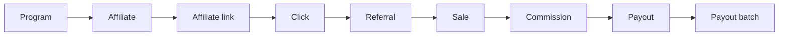

Every figure in your dashboard, every webhook payload, and every API response is assembled from the
same small set of objects. This page describes each one, the fields you will actually touch, and the
relationships that connect them.

## The object graph

A referral moves left to right through this chain. Each step creates a row that points back at the
one before it, which is how Referly can answer "who earned this, and why" for any amount it pays out.

Two objects sit outside the chain but feed into it. **Coupons and promotional codes** give an
affiliate a second way to be credited, without a link or a click. **Commission plans** decide how
much a sale is worth, and are attached to the affiliate rather than to the sale.

Everything below is scoped to a single program. Your API key is issued for one program, so you never
pass a program ID to the REST API — the key already identifies it.

## Program

The container for everything else. One program means one affiliate portal, one currency, one
attribution window, and one API key.

| Field | Type | Notes |
| --- | --- | --- |
| `id` | string (UUID) | The value you put in `data-program-id` on the tracking script. |
| `name` | string | Display name in the portal and emails. |
| `subdomain` | string | The affiliate portal address, unique across Referly. |
| `currency` | string | ISO currency code. Every amount on every object below is in this currency. |
| `cookieDuration` | integer | Attribution window in days. Defaults to `60`. |
| `paymentTrigger` | enum | Whether commission is earned on purchase or on another event. |
| `minPayoutThreshold` | number | Balance an affiliate must reach before a payout is generated. |
| `deductTaxFromCommission` | boolean | Subtract tax from the commission base. On by default. |
| `deductShippingFromCommission` | boolean | Subtract shipping from the commission base. On by default. |
| `numOfPaymentsLimit` | integer | Program-wide cap on how many payments per customer earn commission. |
| `numOfMonthsLimit` | integer | Program-wide cap on how long a customer keeps earning commission. |

Programs are not exposed as a REST resource. You read and configure them in the dashboard; the API
operates inside whichever program your key belongs to.

## Affiliate

A person promoting your product. Affiliates are created when someone signs up through your portal,
when you import them, or when you call the API.

| Field | Type | Notes |
| --- | --- | --- |
| `id` | string (UUID) | Referenced as `affiliateId` on links, clicks, referrals, sales, commissions, and payouts. |
| `firstName`, `lastName`, `email` | string | Identity. Email is how most integrations look an affiliate up. |
| `status` | enum | Whether the affiliate can earn. See [Statuses and enums](/developer-documentation/reference/statuses-and-enums). |
| `programId` | string (UUID) | The program this affiliate belongs to. |
| `affiliateLinks` | array | Every link record for this affiliate — the authoritative source. |
| `link` | string | Deprecated single-link field, often `null`. Read `affiliateLinks` instead. |
| `commissionRate` | number | Per-affiliate override, used only when the affiliate is not following their plan's rate. |
| `commissionPlanid` | string (UUID) | The plan that prices this affiliate's sales. |
| `affiliateGroupId` | string (UUID) | Optional grouping, used for visibility rules and default plans. |
| `commissionTierId` | string (UUID) | Current performance tier, if the program uses tiers. |
| `referredById` | string (UUID) | The affiliate who recruited this one. Drives second-tier commissions. |
| `numberOfClicks`, `numberOfReferredUsers`, `totalCommissionEarned`, `totalRevenue` | number | Running totals maintained by Referly. Read them; do not compute payouts from them. |
| `payoutEmail`, `paymentMethod` | string, enum | Where and how the affiliate gets paid. |
| `createdAt`, `updatedAt` | timestamp | ISO 8601. |

An affiliate belongs to exactly one program. The same person promoting two of your programs is two
affiliate records with two IDs.

## Affiliate link

The referral link itself. An affiliate can hold several, which is how you attribute the same person
across different campaigns or landing pages.

| Field | Type | Notes |
| --- | --- | --- |
| `id` | string (UUID) | Referenced as `affiliateLinkId` on clicks, referrals, and sales. |
| `link` | string | The slug that appears in the URL, not the full address. |
| `userId` | string (UUID) | The affiliate who owns it. |
| `programId` | string (UUID) | The program it belongs to. |
| `promotionalCodeId` | string (UUID) | Optional promo code applied automatically when the link is used. |
| `fullURLs` | array | Read-only on the API: the complete addresses this slug resolves to. |

The pair `programId` plus `link` is unique, so a slug can be reused across programs but never within
one.

## Click

A visit that arrived with affiliate attribution. Clicks are what the tracking script writes, and
they carry the richest context of any object in the model.

| Field group | Fields | Notes |
| --- | --- | --- |
| Attribution | `affiliateId`, `affiliateLinkId`, `referralId`, `affiliateProgramId` | `referralId` is filled in later, when the visitor converts. |
| Identity | `deviceId`, `ipAddress`, `uniqueClick` | `uniqueClick` marks first visits apart from repeats. |
| Landing page | `fullLandingUrl`, `pathname`, `queryString` | Captured verbatim from the browser. |
| Campaign | `utmSource`, `utmMedium`, `utmCampaign`, `utmTerm`, `utmContent` | |
| Ad click IDs | `gclid`, `gbraid`, `wbraid`, `fbclid`, `msclkid`, `ttclid`, `twclid`, `liFatId` | |
| External network | `extClickId` | Populated from the `rsubID` URL parameter and replayed to postbacks. |
| Referrer | `documentReferrer`, `referrerDomain`, `referrerType` | `referrerType` classifies the source as direct, search, social, email, paid, or unknown. |
| Device | `userAgent`, `browserName`, `browserVersion`, `osName`, `osVersion`, `deviceType` | Derived server-side from the user agent. |
| Screen | `screenWidth`, `screenHeight`, `viewportWidth`, `viewportHeight`, `colorDepth`, `pixelRatio` | |
| Locale | `language`, `languages` | From the browser. |
| Geo | `geoCountry`, `geoRegion`, `geoCity`, `geoIsp`, `isProxy`, `isVpn` | Enriched from the IP address, never sent by the browser. |

Clicks have a composite identity of `id` plus `createdAt`, because the table is partitioned by time.
There is no click endpoint on the REST API — clicks reach you through dashboard analytics, exports,
and postbacks. The full capture list is documented in
[Tracking parameters](/developer-documentation/reference/tracking-parameters) and
[What gets captured](/developer-documentation/tracking/click-data).

Add-to-cart events are recorded as their own rows against the originating click, so mid-funnel
activity can be reported without waiting for a sale.

## Referral

A customer that an affiliate brought in. A referral is created the first time you tell Referly that
a tracked visitor converted — signed up, started a trial, or paid.

| Field | Type | Notes |
| --- | --- | --- |
| `id` | string (UUID) | Referenced as `referralId` on sales and clicks. |
| `referredUserExternalId` | string | Your identifier for this customer. Supply it so later sales attach to the right referral. |
| `email` | string | Unique per program. Sending the same email twice returns the existing referral rather than creating a second one. |
| `name` | string | Display name. |
| `affiliateId` | string (UUID) | Who gets credit. |
| `affiliateLinkId` | string (UUID) | The specific link that produced the conversion. |
| `subscriptionStatus` | enum | Whether the customer is still active. Exposed as `status` on the API. |
| `referralMedium` | enum | Whether the credit came from a link or a coupon. |
| `submissionType` | enum | Whether Referly created it automatically or you did. |
| `source`, `integrationReferralSource` | enum | Which surface reported it, and which integration if any. |
| `commissionPlanId` | string (UUID) | Plan snapshot at conversion time, so later pricing changes do not rewrite history. |
| `plan` | string | Free-text plan or tier name from your system. |
| `totalRevenue`, `totalCommission` | number | Running totals across every sale for this customer. |
| `initialLandingPage` | string | First page the customer landed on. |
| `metadata` | object | Arbitrary JSON you attach and read back. |
| `createdAt` | timestamp | ISO 8601. |

The uniqueness rule is `email` plus program. That is what makes conversion reporting safe to retry —
see [Idempotency](/developer-documentation/server-side/idempotency).

## Sale

One payment by a referred customer. A referral has many sales: the first order and every renewal,
upgrade, or repeat purchase after it.

| Field | Type | Notes |
| --- | --- | --- |
| `id` | integer | Sales use auto-incrementing integers, not UUIDs. |
| `referralId` | string (UUID) | The customer who paid. |
| `affiliateId` | string (UUID) | Denormalised from the referral for fast reporting. |
| `affiliateLinkId` | string (UUID) | The link credited with this payment. |
| `externalId` | string | Your order or charge ID. Unique per program — this is the idempotency key. |
| `externalInvoiceId` | string | Your invoice ID. Also unique per program. |
| `totalEarned` | number | The commissionable amount of the payment, in the program currency, after any tax and shipping deduction. |
| `taxAmount`, `shippingAmount` | number | Recorded as sent. Subtracted from the commission base when the program deducts them, which it does by default. |
| `commissionRate` | number | Rate applied to this sale. |
| `commissionEarned` | number | Convenience field on API responses and webhooks: the commission belonging to the sale's own affiliate. |
| `productsBought` | array | Product identifiers, used by product-specific commission rules. |
| `status` | enum | Active or refunded. |
| `refundedAt` | timestamp | Set when the sale is refunded. |
| `paymentTrigger` | enum | What kind of event this payment represents. |
| `promotionalCodeId` | string (UUID) | Set when the customer used an affiliate's code. |
| `source`, `integrationSalesSource` | enum | Which surface reported it. |
| `name`, `email` | string | Customer details as sent with the payment. |
| `metadata` | object | Arbitrary JSON. |
| `createdAt` | timestamp | ISO 8601. |

Posting a sale with an `externalId` you have already used updates that sale instead of creating a
duplicate. See [Reporting sales](/developer-documentation/server-side/reporting-sales).

## Commission

What an affiliate earned from a sale. Commissions are created by Referly, never by you directly —
you report the sale and Referly prices it from the affiliate's commission plan.

| Field | Type | Notes |
| --- | --- | --- |
| `id` | integer | Auto-incrementing. |
| `saleId` | integer | Required. Every commission traces back to exactly one sale. |
| `affiliateId` | string (UUID) | Who earned it. Not necessarily the sale's affiliate. |
| `commissionEarned` | number | Amount, in the program currency. |
| `approvalStatus` | enum | Whether the amount is payable, waiting for review, or declined. |
| `holdReason` | enum | Why it is on hold, when it is. |
| `rewardType` | enum | Cash, or a non-cash reward. |
| `nonCashRewardType`, `creditAmount`, `creditUnit`, `couponId` | mixed | Populated for non-cash rewards. |
| `payoutId` | string (UUID) | Set once the commission is attached to a payout. |
| `payoutCreated`, `manuallyPaid` | boolean | Settlement flags. |
| `bonusReason` | string | Set on commissions created by bonuses rather than sales. |
| `createdAt`, `updatedAt` | timestamp | ISO 8601. |

A single sale can produce more than one commission. When your program has multi-tier rewards
enabled, the affiliate who recruited the selling affiliate earns from the same sale, and so can the
tier above them. That is why the API surfaces `commissionEarned` for the sale's own affiliate rather
than a sum.

Performance bonuses, contest prizes, and content rewards also produce commissions, with no sale
revenue behind them. They are how non-sale earnings enter the same payout pipeline.

Commissions have no REST resource of their own. You read them through the sale that produced them
and through payouts.

## Payout

Money owed to one affiliate for a period. A payout gathers the commissions that were payable when it
was generated and freezes them into a single amount.

| Field | Type | Notes |
| --- | --- | --- |
| `id` | string (UUID) | |
| `affiliateId` | string (UUID) | Who is being paid. |
| `amount` | number | Total, in the program currency. |
| `status` | enum | Where the payment is in its lifecycle. |
| `paymentMethod` | enum | The rail used. |
| `periodStart`, `periodEnd` | timestamp | The window the payout covers. |
| `payoutBatchId` | string (UUID) | The batch it was processed in. |
| `commissions` | array | The commissions rolled into this amount. |
| `externalId` | string | The provider's transfer ID, once sent. |
| `commissionSubtotal`, `vatAmount`, `vatRate`, `vatZone` | number, enum | Tax breakdown for affiliates who invoice with VAT. |
| `invoiceSequence` | integer | Per-affiliate invoice number. |
| `manuallyPaid` | boolean | Set when you settled outside Referly. |
| `paidAt`, `failedReason` | timestamp, string | Outcome. |

## Payout batch

A group of payouts processed together — one program, one payment method, one period. Batches are the
unit you approve and fund, and the only payout object with a REST endpoint.

| Field | Type | Notes |
| --- | --- | --- |
| `id` | string (UUID) | |
| `status` | enum | Batch lifecycle, separate from individual payout status. |
| `payoutMethod` | enum | The rail every payout in the batch uses. |
| `periodStart`, `periodEnd` | timestamp | The window the batch covers. |
| `autoGenerated` | boolean | Whether Referly created it on schedule or you did. |
| `payouts` | array | The payouts it contains. |
| `externalBatchId`, `failedReason` | string | Provider reference and failure detail. |
| `rewardType`, `nonCashRewardType` | enum | Non-cash batches settle rewards rather than money. |

A payout can fail while its batch succeeds, so check both statuses when reconciling.

## Coupon and promotional code

The second way an affiliate gets credit. A **coupon** is the discount itself; a **promotional code**
is a redeemable string pointing at that coupon. One coupon can back many codes, which is how every
affiliate can have a personal code that grants the same discount.

**Coupon**

| Field | Type | Notes |
| --- | --- | --- |
| `id` | string (UUID) | |
| `couponType` | enum | `PERCENTAGE` or `FLAT`. |
| `percentOff`, `amountOff`, `currency` | number, string | One pair applies, depending on `couponType`. |
| `duration`, `durationInMonths` | enum, integer | How long the discount lasts on a subscription. |
| `maxRedemptions`, `timesRedeemed`, `redeemBy`, `valid` | mixed | Redemption limits and current state. |
| `limitToProducts`, `productIds`, `collectionIds` | boolean, array | Scope the discount to specific products. |
| `externalId` | string | The matching object in Stripe or Shopify. |
| `integrationType` | enum | Which platform owns the underlying discount. |

**Promotional code**

| Field | Type | Notes |
| --- | --- | --- |
| `id` | string (UUID) | Referenced as `promotionalCodeId` on sales and links. |
| `code` | string | What the customer types at checkout. |
| `couponId` | string (UUID) | The discount it grants. |
| `affiliateId` | string (UUID) | The affiliate credited when it is used. |
| `active`, `expiresAt`, `maxRedemptions`, `timesRedeemed` | mixed | Availability and usage. |
| `firstTimeOrder`, `minimumAmount`, `minimumAmountCurrency` | boolean, number, string | Redemption conditions. |
| `limitToCustomers`, `customerId`, `limitToAffiliate` | boolean, string | Restrict who may redeem. |
| `isAutoGenerated`, `isAffiliateGenerated` | boolean | Whether Referly or the affiliate created it. |
| `externalId` | string | The matching object on the payment platform. |

When a sale arrives carrying a promotional code, Referly attributes it to that code's affiliate even
if there was never a click. See
[Coupons and promotional codes](/api-reference/coupons-and-promotional-codes).

## Pricing objects

These decide what a sale is worth. They attach to the affiliate, not the sale, and are resolved at
the moment commission is calculated.

| Object | Purpose | Key fields |
| --- | --- | --- |
| Commission plan | The rate and its rules. | `commissionRate`, `commissionType`, `paymentTrigger`, `numberOfPayments`, `numberOfMonths`, `autoApproveRewards`, `rewardType` |
| Commission rule group | Conditions a sale must meet for a plan or amount to apply. | `baseCondition`, rules |
| Commission amount | An alternative rate used when a rule group matches. | Rate, reward type |
| Commission tier | Performance level an affiliate reaches. | `tier`, `name`, `minReferrals`, `minRevenue`, `conditionType` |
| Affiliate group | Segments affiliates for visibility and defaults. | `name`, `color`, `defaultCommissionPlanId` |

A plan can pay cash or a non-cash reward — account credit, a coupon, or a free product — and the
resulting commission carries the reward type through to the payout.

## Identifiers at a glance

| Object | ID type | Your own identifier | Uniqueness |
| --- | --- | --- | --- |
| Program | UUID | — | Global |
| Affiliate | UUID | `email` | Email per program |
| Affiliate link | UUID | `link` slug | Slug per program |
| Click | integer plus timestamp | — | Not exposed on the API |
| Referral | UUID | `referredUserExternalId` | `email` per program |
| Sale | integer | `externalId`, `externalInvoiceId` | Each unique per program |
| Commission | integer | — | Not exposed on the API |
| Payout | UUID | — | — |
| Payout batch | UUID | — | — |
| Coupon | UUID | `externalId` | — |
| Promotional code | UUID | `code`, `externalId` | — |

Use your own identifiers, not Referly's, as the join key in your system. They are what make retries
safe and what let you reconcile without storing Referly IDs.

## Where each object appears

| Object | REST API | Webhooks |
| --- | --- | --- |
| Affiliate | `/affiliates` | `affiliate.created`, `affiliate.updated`, `affiliate.deleted` |
| Referral | `/referrals` | `referral.created`, `referral.updated`, `referral.deleted` |
| Sale | `/sales` | `sale.created`, `sale.updated`, `sale.deleted` |
| Affiliate link | `/links` | Included in affiliate payloads |
| Coupon | `/coupons` | `coupon.created`, `coupon.updated`, `coupon.deleted` |
| Promotional code | `/promotional-codes` | `promocode.created`, `promocode.updated`, `promocode.deleted` |
| Payout batch | `/payout-batches` | No dedicated event |
| Payout | Not exposed | Included in sale payloads as `payout` |
| Click, commission | Not exposed | Commission amounts appear inside sale payloads |

Webhook payloads embed related objects rather than making you fetch them — a `sale.created` body
carries the sale, its affiliate, its referral, its commission amount, and its payout if one exists.
See [Payload structure](/developer-documentation/webhooks/payload-structure).

## Related

<Columns cols={2}>
  <Card title="Statuses and enums" icon="list-check" href="/developer-documentation/reference/statuses-and-enums">
    Every status value these objects can hold, and what each one means.
  </Card>
  <Card title="Tracking parameters" icon="link" href="/developer-documentation/reference/tracking-parameters">
    The URL parameters and click fields Referly reads and stores.
  </Card>
  <Card title="Core concepts" icon="diagram-project" href="/developer-documentation/getting-started/core-concepts">
    How attribution, conversion, and settlement fit together.
  </Card>
  <Card title="API reference" icon="terminal" href="/api-reference/introduction">
    Endpoint-by-endpoint documentation for every resource above.
  </Card>
</Columns>
